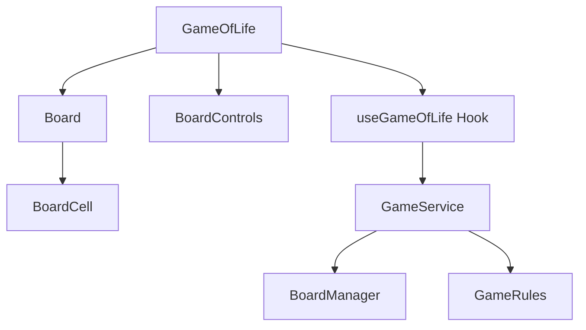
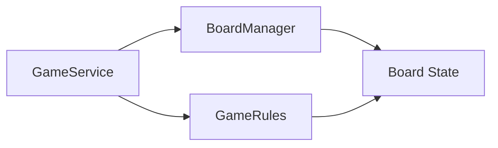
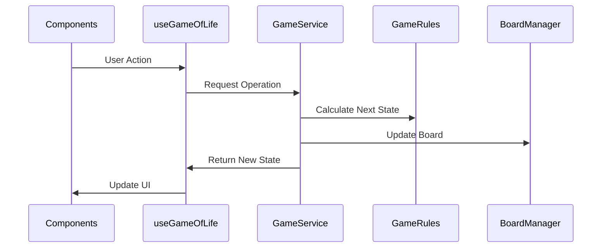

# Game of Life Architecture

## Component Architecture

## Service Layer Design

## Data Flow

## Design Decisions

### Component Architecture
- **Single Source of Truth**: Game state managed by useGameOfLife hook
- **Unidirectional Data Flow**: State flows down, actions flow up
- **Component Isolation**: Each component has a single responsibility

### Service Layer
- **Dependency Injection**: Services are injected for better testability
- **Interface Segregation**: Clear interfaces for each service
- **Immutability**: All state updates create new instances

### State Management
- **React Hooks**: Used for local state management
- **Custom Hook**: Encapsulates game logic and state
- **Memoization**: Optimizes performance for frequent updates

## Extensibility Considerations

1. **Adding New Features**
   - New game rules can be added by extending `IGameRules`
   - Additional board operations through `IBoardManager`
   - UI components are independent and reusable

2. **Modifying Game Rules**
   - Game rules are isolated in `GameRules` service
   - Rules can be changed without affecting other components
   - New rule sets can be added by implementing `IGameRules`

3. **Future Improvements**
   - Support for different board shapes/sizes
   - Custom rule sets
   - State persistence
   - Game statistics tracking